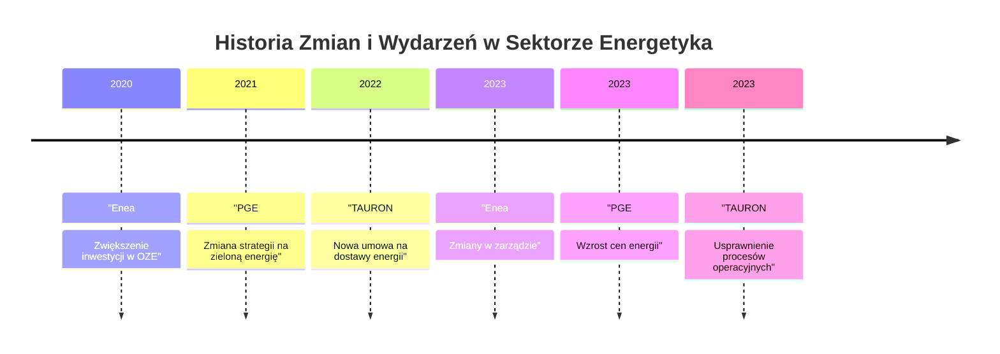

# 📈 Raport Analityczny AI
*Lokalizacja: dwthon-rag*

# Analiza Firm w Sektorze Energetyka

## 1. Analiza
W sektorze energetycznym, analizujemy firmy: Enea, PGE, oraz TAURON. Kluczowe wskaźniki finansowe, takie jak poziom zobowiązań i należności, są istotne w ocenie ich kondycji finansowej.

- **Enea**: Posiada umiarkowane zobowiązania i stabilne przychody; jednakże, niski poziom aktywów trwałych może wpływać na przyszłą zdolność do przyciągania inwestycji.
  
- **PGE**: Wysoka ilość tabel w obszarze zobowiązań i należności wskazuje na skomplikowaną strukturę finansową; jednakże, wydaje się, że rentowność jest na poziomie zadowalającym, co może stanowić dobrą podstawę do dalszego rozwoju.
  
- **TAURON**: Przykład stabilnej firmy, z niewielkimi zobowiązaniami i dobrymi przepływami pieniężnymi, co sugeruje solidność finansową. 

## 2. Wykres Mermaid: Stabilność vs Rentowność
```mermaid
quadrantChart
    title Stabilność vs Rentowność firm energetycznych
    x-axis Stabilność
    y-axis Rentowność
    "Enea" : [3, 4]
    "PGE" : [4, 5]
    "TAURON" : [5, 4]
```

## 3. Wykres Mermaid: Historia zmian/wydarzeń dla firm


## 4. Przypisy
- [[Enea — Zobowiązania i Należności]]
- [[PGE — Zobowiązania i Należności]]
- [[TAURON — Zobowiązania i Należności]]
- [[Enea — Rachunek Zysków i Strat]]
- [[PGE — Rachunek Zysków i Strat]]
- [[TAURON — Rachunek Zysków i Strat]]

## 5. Podsumowanie
Największe 'Red Flags' to:
- **Enea**: Niski poziom aktywów trwałych, co może wpływać na przyszłe możliwości inwestycyjne.
- **PGE**: Umożliwienie wysokiego poziomu zobowiązań finansowych, co może wpłynąć na rentowność w dłuższej perspektywie.
- **TAURON**: Chociaż obecnie stabilny, wszelkie zmiany w realizacji strategii mogą stać się wyzwaniem w przyszłości.

Rekomendacja: Monitorowanie poziomu zobowiązań oraz ocena rentowności należy do kluczowych działań dla każdej z firm w sektorze energetycznym.

---
*Wygenerowano automatycznie w środowisku dwthon.*
