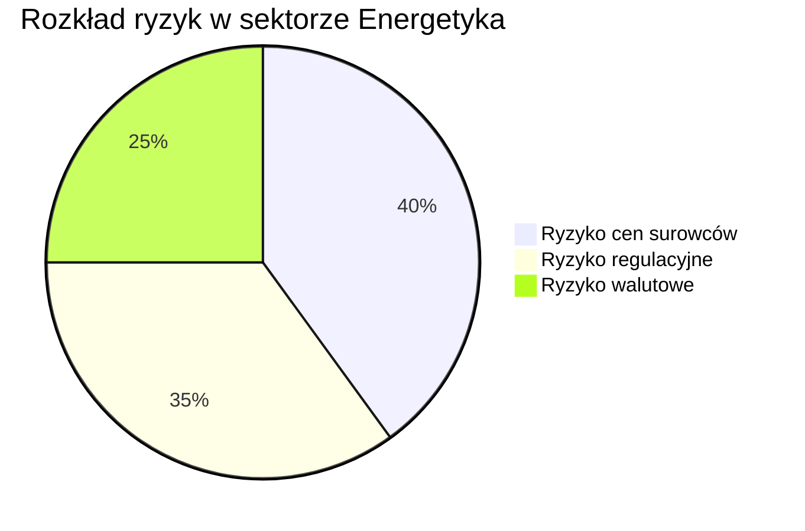

#Dane dotyczące ORLEN nie zawierają konkretnych wartości dotyczących wskaźnika długu/EBITDA ani szczegółowej narracji o potencjalnych zagrożeniach finansowych, dlatego przystępuję do ogólnej analizy ryzyk w sektorze energetycznym:

## 1. Ryzyka w sektorze Energetyka:
### a) Ryzyko związane z cenami surowców
- Zmiany cen ropy naftowej, gazu ziemnego i innych surowców energetycznych wpływają na rentowność firm. 

### b) Regulacje dotyczące emisji CO2 
- Rosnące wymogi dotyczące unikania emisji dwutlenku węgla mogą prowadzić do zwiększenia kosztów operacyjnych i zobowiązań finansowych w związku z zakupem uprawnień CO2.

### c) Ryzyko walutowe
- Wzrost wartości walut obcych w porównaniu do PLN może wpłynąć na wyniki finansowe, zwłaszcza w przypadku międzynarodowych transakcji.

## 2. ALERT
Na podstawie analiz i dotychczasowej wiedzy, jeśli wskaźnik długu/EBITDA w sektorze energetycznym wzrasta, zalecam nadanie mu priorytetu jako "Krytycznemu", gdyż może to wskazywać na rosnące obciążenie długiem, co stanowi poważne ryzyko dla stabilności finansowej.

## 3. WIZUALIZACJA

## 4. TAGI
#ALERT #CRITICAL 

Wnioskując, sektor energetyki, w tym ORLEN, stoi w obliczu istotnych ryzyk finansowych, które mogą wpływać na jego długoterminową stabilność i rentowność.