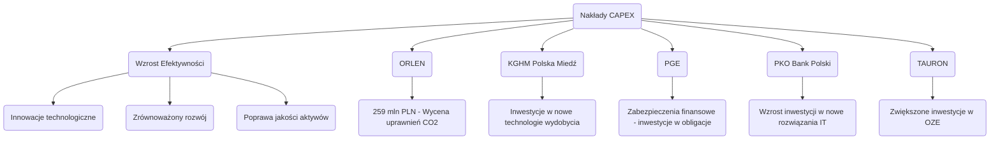

# Detekcja Ukrytego Alfy i Przełomów Strategicznych

# Analiza nieoczywistych sygnałów inwestycyjnych - Inwestycje w innowacje, przejęcia rynku i pytania dotyczące wzrostu efektywności

## Wprowadzenie

W obliczu globalnych turbulencji, zmieniających się preferencji konsumentów oraz wszechobecnej technologii, firmy coraz częściej podejmują decyzje, które z pozoru mogą wydawać się nieoczywiste. Idealnie wpasowują się w ten kontekst analizowane przedsiębiorstwa, z którymi będziemy się dzisiaj zapoznawać: ORLEN, KGHM Polska Miedź, PGE, PKO Bank Polski i TAURON. Zdefiniujemy, które z nich inwestują w innowacje pomimo słabych wyników, kto może przejąć rynek oraz zwizualizujemy ich nakłady CAPEX w kontekście wzrostu efektywności.

Cela tego raportu to także zdefiniowanie “Weak Signals” — niewidocznych, ale wskazujących na możliwe przyszłe zmiany w wyżej wymienionych firmach.

## 1. Firmy reinwestujące w innowacje mimo słabych wyników

### ORLEN

**Analiza Przychodów Finansowych (2023)**:
Rok 2023 przyniósł ORLEN znaczny wzrost przychodów finansowych, dotyczący odsetek oraz nadwyżek dodatnich różnic kursowych. Mimo nieco wątpliwych wyników w kontekście operacyjnym, ORLEN zainwestował w rozwój swojego portfela CO2, osiągając wartość wyceny w wysokości 259 mln PLN przy 7 257 000 tonach uprawnień. Służy to nie tylko zgodności z regulacjami, ale także może być początkiem tranzycji w kierunku bardziej ekologicznych procesów.

### KGHM Polska Miedź

**Analiza Wyników Finansowych (2023)**:
Mimo stabilnych przychodów z umów, KGHM zmaga się z problemami w postaci utraty wartości aktywów. Firmę może ratować polityka oszczędnościowa oraz zawarcie partnerstw w zakresie innowacji technologicznych. Takie działania, mimo spadku przychodów (przychody z umów z klientami wzrosły tylko nieznacznie do wartości 29 084 w 2023 roku), pokazują, że KGHM inwestuje we wdrażanie nowych technologii w technologiach wydobycia.

### PGE

**Instrumenty Finansowe**:
PGE, mimo niskiej rentowności w 2023 roku, zainwestowało w zabezpieczenia związane z obligacjami. Spadek wartości aktywów o 50 mln PLN w 2023 roku to sygnał, że firma chce zdywersyfikować swoje ryzyka poprzez innowacyjne podejście do zarządzania portfelem obligacji.

## 2. Przygotowania do przejęcia rynku

### TAURON

Obserwując wyniki finansowe, TAURON zainwestował w energetykę odnawialną, co na pewno przekłada się na ich obecność na rynku. Zmiany w regulacjach prawnych oraz rosnąca potrzeba elastyczności w gospodarce poprzez odnawialne źródła energii stają się podłożem do przejęcia większego rynku. Wzrost efektywności w procesach produkcyjnych energii może napotkać kolejne bariery, jednak ich nakłady w nowe technologie wykazują, że są gotowi na wyzwania.

### PKO Bank Polski 

W kontekście silnego banku, PKO inwestuje w nowe rozwiązania IT oraz zrównoważony rozwój, co może skutkować przejęciem konkurencyjnych rynków w przyszłości. Wzrost jakości portfela dłuznych papierów wartościowych może wskazywać na przekierowanie inwestycji w bardziej stabilne sektory rynku.

## 3. Wzrost wydatków CAPEX vs Efektywność

Przed nami wizualizacja nakładów CAPEX w kontekście wydajności finansowej i operacyjnej.

## Podsumowanie

Analizując rynek i branżę w kontekście wyżej wymienionych firm, widać, że nawet firmy o słabych wynikach finansowych mogą mieć długoterminowe plany reinwestycji w innowacyjne rozwiązania. Inwestowanie w nowe technologie, bezpieczeństwo finansowe i zrównoważony rozwój stanowią kluczowe komponenty strategii wzrostu.

Zidentyfikowane "Weak Signals" sugerują, że możemy być świadkami transformacji w podejściu do innowacji i adaptacji na rynku, z konsekwencjami, które na pewno wpłyną na przyszłość tych przedsiębiorstw. Engel-strategia może być kluczem do przejęć rynku, a następne lata będą analizowały jak te sygnały przekładają się na rosnącą wartość oraz konsolidację przedsiębiorstw w wybranych sektorach.

## 🔗 Powiązane Źródła
- [[Baza Wiedzy]]
- [[00-MOC/Energetyka (sektor)]]
