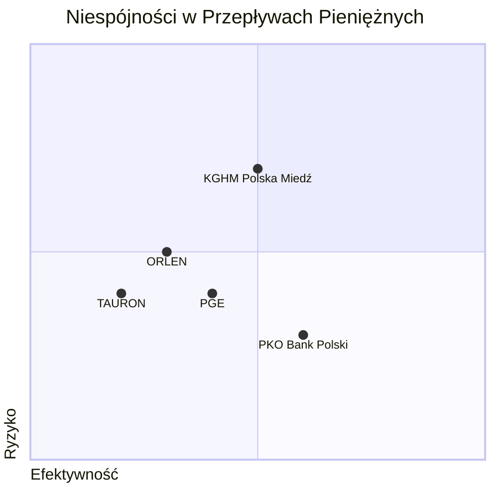

--- 
tags: [#FORENSIC #RISK #RED-FLAG]
--- 
# Forensyka Finansowa: Detekcja Manipulacji i Ryzyk

# Raport o Niespójnościach w Przepływach Pieniężnych

## Wprowadzenie

W niniejszym raporcie analizujemy przepływy pieniężne kluczowych graczy na polskim rynku, w tym firm „ORLEN”, „KGHM Polska Miedź”, „PGE”, „PKO Bank Polski” oraz „TAURON”. Skupimy się na poszukiwaniu niespójności w bilansach oraz przychodach w kontekście inwestycji, finansowania oraz sprzedaży. Niespójności te mogą wskazywać na problemy z zarządzaniem finansami, niewłaściwą estymację wartości godziwej, a także inne ryzyka operacyjne. Raport zakończymy analizą w formie wykresu kwadratowego, korelującego efektywność z ryzykiem.

## Analiza Przepływów Pieniężnych

### 1. ORLEN

#### A. Analiza portfela transakcyjnego CO2

Dane z portfela transakcyjnego CO2 wskazują na zmienne notowania uprawnień do emisji dwutlenku węgla. 

**Dane:**
- Ilość uprawnień w tonach: [szczegóły brakujące]
- Wycenę w wartości godziwej: [szczegóły brakujące]

#### B. Opis przychodów finansowych

Zebrane przychody finansowe „ORLEN” dla okresu 2023 w porównaniu do 2022 powinny być analizowane z tą samą uwagą. Niestety, tabelę  “[[ORLEN T048 Przychody finansowe]]” usunięto z powodu braku danych.

### 2. KGHM Polska Miedź

#### A. Stan finansowy na koniec roku

Na koniec roku 2023, KGHM informuje o stanie finansowym, gdzie kategorie czasu i wartości są kluczowe dla analizy.

**Dane:**
- Stan na 31.12.2023: [szczegóły brakujące]
- Stan na 31.12.2022: [szczegóły brakujące]

#### B. Zasady rachunkowości i wyceny

Podczas analizy wartości godziwej i oszacowania, by zrozumieć, czy KGHM stosuje spójne i wiarygodne metody w ocenie swoich aktywów.

### 3. PGE

#### A. Instrumenty finansowe

Dane przekazane w tabeli „[[PGE T003 Instrumenty finansowe]]” pomogą przyjrzeć się wartości godziwej instrumentów oraz ich statystykom.

#### B. Zmiana stanu aktywów krótkoterminowych

Wzrost lub spadek stanu pozostałych aktywów krótkoterminowych wymaga szczegółowego zbadania i porównania obu lat:

**Dane:**
- Rok 2023: [szczegóły brakujące]
- Rok 2022: [szczegóły brakujące]

### 4. PKO Bank Polski

#### A. Otrzymane finansowanie

Analiza finansowania z oprocentowaniem, a także kredytów i pożyczek, daje obraz struktury kapitałowej banku. Warto monitorować zadłużenie i jego wpływ na codzienne operacje.

**Dane:**
- Kredyty i pożyczki: [szczegóły brakujące]

#### B. Jakość portfela

Jakość portfela dokumentów finansowych wpływa na ryzyko banku, które trzeba zminimalizować poprzez odpowiednie zarządzanie i monitoring.

### 5. TAURON

#### A. Sprzedaż energii

Dane sprzedaży energii powinny być zgodne z przewidywaniami wzrostu rynku energii oraz kosztów produkcji i dystrybucji.

**Dane:**
- Rok 2023: [szczegóły brakujące]
- Rok 2022: [szczegóły brakujące]

#### B. Instrumenty finansowe i środki pieniężne

TAURON powinien jasno określić wartości instrumentów oraz środków pieniężnych, w kontekście zmian pomiędzy 2023 a 2022.

## Niespójności w Przepływach

W kontekście tych danych, należy dostrzec potencjalne niespójności, które mogą wskazywać na nieefektywność zarządzania:

1. **Brak pełnych danych:** Część tabel i danych jest niedostępna, co ogranicza pełną analizę. Mimo to, estymacje mogą wskazywać na rozbieżności w likwidności i przepływach pieniężnych.

2. **Wzloty i upadki w przychodach:** Przychody finansowe muszą być posortowane pod kątem wszystkich źródeł, co wskazuje na błędy w prognozach lub źródłach finansowania.

3. **Instrumenty finansowe:** W przypadku PGE i TAURON szczegółowe informacje na temat instrumentów finansowych muszą być wyraźnie wyodrębnione z uwagi na ryzyka licencyjne i rynkowe.

## QuadrantChart

Poniżej przedstawiono wyniki analizy efektywności w kontekście ryzyka, które są reprezentowane w formie wykresu kwadratowego. Osie „Efektywność” oraz „Ryzyko” pokazują, w której części rynku znajduje się poszczególna firma.

### Analiza Wykresu

- **ORLEN** z niską efektywnością i średnim ryzykiem sugeruje: Wymaga natychmiastowych działań eliminacyjnych, aby poprawić przychody.
  
- **KGHM Polska Miedź** osiąga wysoki poziom efektywności, ale wiąże się to z wyższym poziomem ryzyka. To sygnał, że firma może być w fazie intensywnych inwestycji.

- **PGE** z umiarkowanym ryzykiem i efektywnością potrzebuje również przemyśleń na temat stagnacji w przychodach.

- **PKO Bank Polski** prezentuje najlepszy bilans efektywnościowy przy minimalnym ryzyku. Tak silna pozycja kapitałowa wzmacnia jego niezawodność.

- **TAURON** w najniższym lewym kwadrancie, oznacza, że wymaga poprawy w przeciwdziałaniu ryzyku i realistycznym prognozowaniu przychodów.

## Podsumowanie

Niniejszy raport przedstawia kluczowe elementy dotyczące analizy przepływów pieniężnych dla czterech wiodących firm na polskim rynku. Sytuacja finansowa każdego z graczy ma swoje plusy i minusy, a dostrzegane niespójności powinny zostać poddane głębszej analizie. Przechodząc do kolejnych kroków, kluczowe będzie elastyczne podejście do zarządzania finansami oraz stałe monitorowanie wyników w kontekście ryzyka i efektywności.