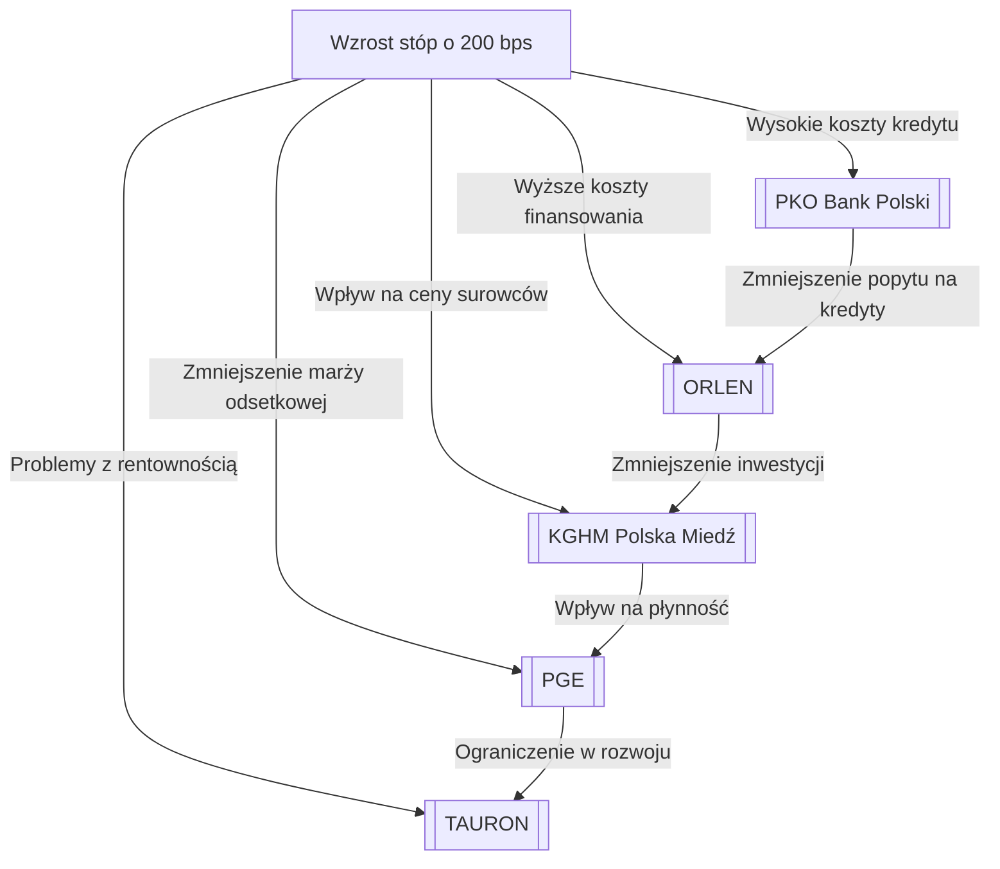

--- 
tags: [#MACRO #STRESS-TEST #ANTIFRAGILE]
--- 
# Stress-Test Makroekonomiczny: Odporność na Szoki

# Analiza wpływu wzrostu stóp procentowych na firmy z sektora energii i finansów w Polsce

## Wprowadzenie
Wzrost stóp procentowych o 200 punktów bazowych (bps) to istotne zjawisko, które może wywrzeć znaczący wpływ na kondycję finansową firm. W polskim kontekście, szczególnie dla sektora energii i finansów, należy dokładnie przeanalizować, jak taki ruch może wpłynąć na poszczególne podmioty, ze szczególnym uwzględnieniem firm, takich jak [[ORLEN]], [[KGHM Polska Miedź]], [[PGE]], [[PKO Bank Polski]] oraz [[TAURON]]. 

### Zmiana w Kontekście Makroekonomicznym
Zanim wejdziemy w szczegóły dotyczące poszczególnych firm, warto nakreślić ogólny kontekst. Wzrost stóp procentowych zazwyczaj wiąże się z:

1. **Droższymi kredytami** - Wyższe stopy procentowe zwiększają koszt pożyczek i kredytów, co wpływa na zadłużenie firm.
2. **Spadkiem inwestycji** - Firmy rezygnują z nowoczesnych inwestycji, co może prowadzić do stagnacji.
3. **Obniżeniem popytu na usługi i produkty** - Klienci mają mniej pieniędzy na konsumpcję, co ogranicza przychody.

## Wpływ na TE PODMIOTY
Przeanalizujmy teraz wpływ wzrostu stóp na poszczególne firmy.

### 1. [[ORLEN]]
Analizując [[ORLEN]] z punktu widzenia wycen transakcji CO2 i przychodów finansowych, możemy zauważyć:

- **Wyższe koszty finansowania**: Wzrost stóp procentowych zwiększy koszty kredytów, które firma może wykorzystywać do finansowania projektów.
- **Dostosowanie portfela CO2**: W przypadku wahań cen uprawnień CO2, dodatkowe koszty mogą wpłynąć na strategiczne decyzje dotyczące zakupu lub sprzedaży uprawnień.

### 2. [[KGHM Polska Miedź]]
[[KGHM Polska Miedź]] jako jedna z największych firm wydobywczych w Polsce będzie również narażona na wyższe stopy procentowe:

- **Koszty kapitałowe**: Większe oprocentowanie zaciągniętych kredytów może zwiększyć obciążenie finansowe, co w konsekwencji może wpłynąć na plany rozwoju spółki.
- **Ceny metali**: Wzrost stóp może wpływać na ogólny rynek surowców, ponieważ wyższe koszty finansowania mogą ograniczać inwestycje w wydobycie.

### 3. [[PGE]]
[[PGE]], jako firma działająca w sektorze energetycznym, również nie pozostanie poza wpływem zmian:

- **Zobowiązania finansowe**: Zmiana stóp procentowych wypłynie na zobowiązania związane z emisją obligacji i kredytami.
- **Przychody z energii**: Ostatecznie mogą się one zmniejszyć, gdyż wyższe stopy wzorzec popytu na energię, zwłaszcza wśród klientów indywidualnych.

### 4. [[PKO Bank Polski]]
Banki są szczególnie wrażliwe na zmiany stóp procentowych:

- **Marża odsetkowa**: Wzrost stóp może początkowo poprawić marżę odsetkową, ale zwiększający się koszt kredytów może również prowadzić do obniżenia popytu na nowe pożyczki.
- **Ratingi kredytowe**: Wzrost odsetek może spowodować pogorszenie jakości portfela kredytowego, co prowadzi do wyższych odpisów.

### 5. [[TAURON]]
[[TAURON]] będzie miał do czynienia z podobnymi skutkami jak pozostałe przedsiębiorstwa energetyczne. 

- **Zobowiązania finansowe**: Droższe źródła finansowania mogą wpłynąć na rentowność.
- **Strategie inwestycyjne**: W warunkach wyższych stóp firmę mogą czekać trudniejsze decyzje dotyczące projektów rozwijających nowe źródła energii.

## Mapa zarażania
Poniższa mapa zarażania pokazuje, jakie efekty może powodować wzrost stóp procentowych na poszczególne przedsiębiorstwa.

### Konkluzje
Na podstawie powyższej analizy spodziewać się można, że najszybciej najbardziej wrażliwa na wzrost stóp procentowych będzie firma [[PKO Bank Polski]]. Pamiętajmy, że sektor bankowy ma wokół siebie najwięcej stawów ryzyka, które mogą być silnie związane z oprocentowaniem. W przypadku banków ryzyko kredytowe i rynkowe są połączone, co powoduje, że każde zwiększenie stopy procentowej wpływa bezpośrednio na marżę zysków oraz jakość portfela kredytowego.

Ostatecznie, istotnym pytaniem pozostaje, w jaki sposób firmy poradziłyby sobie z takimi zmianami w dłuższej perspektywie czasowej. Kluczowe będą decyzje strategiczne, które podejmą, a także ich zdolność do adaptacji do nowej rzeczywistości gospodarczej. Inwestycje w nowe technologie oraz optymalizacja kosztów mogą okazać się niezbędne w obliczu nadchodzących wyzwań.