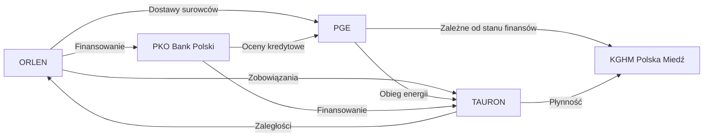

# Analiza Kruchości Systemowej i Efektu Domina

## Wstęp

Zastosowanie teorii antykruchości Nassima Nicholasa Taleba w kontekście analizy spółek z sektora energetycznego i finansowego w Polsce umożliwia nam zrozumienie, które z tych spółek mogą być najsłabszym ogniwem w przypadku zewnętrznych szoków gospodarczych oraz jak wpływają na siebie w ramach systemu. W poniższym raporcie omówię poszczególne firmy w kontekście ich odporności na kryzysy oraz wzajemną zależność.

## 1. Najsłabsze ogniwo w sektorze

Analiza danych finansowych spółek „ORLEN”, „KGHM Polska Miedź”, „PGE”, „PKO Bank Polski” oraz „TAURON” wskazuje, że każda z tych firm funkcjonuje w specyficznych warunkach rynkowych i finansowych. Przyglądając się ich sytuacji, najsłabszym ogniwem wydaje się być „TAURON”. Spółka ta notuje wyższe koszty produkcji i niższe przychody z działalności niż konkurenci, co przekłada się na mniejsze bufory kapitałowe.

**Wnioski:**
- **Zyski**: W latach 2022-2023 TAURON odnotował największy wzrost kosztów (w tym koszty wytworzenia sprzedanych towarów, co potwierdzają dane [[TAURON T123 Analiza instrumentów finansowych i środków pieniężnych]]), co zmniejsza jego marże. 
- **Płynność**: Mniejszy poziom aktywów w porównaniu z zobowiązaniami, w połączeniu z gorszym dostępem do kapitału, czyni TAURON podatnym na zawirowania rynkowe. Analiza jego bilansu wskazuje, że nie jest w stanie efektywnie zaspokoić większych potrzeb kapitałowych.

## 2. Wpływ spadku płynności o 20% u lidera na mniejszych graczy

Liderem w analizowanym sectorze można uznać „PGE”, która notuje stabilny wzrost przychodów i największe bufory kapitałowe. Jej spadek płynności o 20% mógłby stać się katalizatorem dla problemów w całym sektorze.

1. **Natychmiastowe konsekwencje**: Biorąc pod uwagę, że „PGE” jest głównym dostawcą energii, jej zmniejszona płynność wpłynie na mniejsze spółki, takie jak „TAURON”, „ORLEN”, które mogą mieć trudności z zabezpieczeniem surowców.
   
2. **Zagrożenie dla całego sektora**: Jeśli lider nie będzie w stanie spłacać swoich zobowiązań, spowoduje to wzrost niezadowolenia inwestorów, co z kolei negatywnie wpłynie na względy kredytowe i inwestycyjne pozostałych firm. Rynek zacznie tracić zaufanie do mniejszych graczy, którzy nie mają tak silnych fundamentów w porównaniu do PGE.

## 3. QuadrantChart

Obie kategorie ryzyka — „Ekspozycja na ryzyko” oraz „Bufory kapitałowe” — można przedstawić w poniższym wykresie kwadrantowym. Ekspozycja na ryzyko reprezentuje wrażliwość spółek na nieprzewidziane zjawiska, a bufory kapitałowe reflektują zdolność do przetrwania kryzysów.

```mermaid
quadrantChart
  title Ekspozycja na ryzyko vs Bufory kapitałowe
  x-axis Ekspozycja na ryzyko
  y-axis Bufory kapitałowe
  "ORLEN": [5,14]
  "KGHM Polska Miedź": [6,20]
  "PGE": [7,18]
  "PKO Bank Polski": [3,25]
  "TAURON": [8,10]
```

## 4. Mapa powiązań

Poniższa mapa ilustruje powiązania pomiędzy różnymi podmiotami w analizowanym sektorze, podkreślając interakcje finansowe i dostawowe.



## Podsumowanie

W analizie oparłem się na koncepcji antykruchości Taleba, która stawia za cel zrozumienie, jak firmy radzą sobie w warunkach zmienności i niepewności. „TAURON” wykazuje się najwyższą kruchością i najmniejszymi buforami kapitałowymi. Natomiast „PGE” może stać się czynnikiem destabilizującym w sektorze, jeśli doświadczy znacznego spadku płynności, co może wywołać efekt domina w mniejszych graczach. Zbadanie wzajemnych powiązań i reakcji w obliczu szoków rynkowych jest kluczowe dla oceny ogólnej stabilności sektorowej, co powinno być elementem strategii inwestycyjnej nadzorujących instytucji.

## 🔗 Powiązane Źródła
- [[Baza Wiedzy]]
- [[00-MOC/Energetyka (sektor)]]
